  

  
  
  

---

### About

BS Computer Science graduate (Andres Bonifacio College, 2026). I build practical software: offline-first mobile apps, LAN-based classroom tools, polished front-end showcases, and barangay information systems for a startup in the Philippines.

I'm also into computer hardware. I build and troubleshoot PCs on the side, so if the code breaks, there's a decent chance I can fix the machine running it too.

**Currently looking for my first full-time role in Android or front-end development.**

---

### Tech stack

  

---

### Projects

#### BizPalm Mobile

[Repository](https://github.com/Chie03-dev/BizPalm-Mobile) | v1.0.0

  
  
  
  
  

An **offline-first POS and inventory app** for small retail stores, sari-sari stores and pharmacies. It runs without an internet connection, so a store keeps working when the signal doesn't.

- **Stack:** Kotlin, Java, Room, MVVM, CameraX, ML Kit, MPAndroidChart, iText
- **Highlights:** works fully offline, inventory and sales tracking, charts and PDF reports
- **My role:** front-end UI, database connections, and CRUD functionality
- **Screenshots:** see the [app gallery in the repo](https://github.com/Chie03-dev/BizPalm-Mobile#readme)

---

#### Barangay Resident Portal

[Live demo](https://barangay.myappmcb.workers.dev)

  
  
  
  
  

A resident-facing portal for barangay services: document requests, incident reporting, request tracking and an officials directory. Built as a **front-end showcase** (all data is mocked) with a glassmorphic design system, Framer Motion transitions and a mobile layout with a floating nav dock.

- **Stack:** Next.js 15, React 19, TypeScript (strict), Tailwind CSS v4, Framer Motion, deployed to Cloudflare Workers through OpenNext
- **Highlights:** cinematic login with a 3D tilt card, bento dashboard with an SVG barangay map and community calendar, four-step document request flow, request timeline with a pick-up pass, three-tier officials org chart
- **Details:** dark mode by default with no theme flash, full `prefers-reduced-motion` support, and no web fonts downloaded (served assets total about 55 KB)
- **Try it:** sign in with any email and password

---

#### Quiz LAN System

A classroom quiz system that runs entirely on the local network. No cloud, no CDNs, no internet needed. It is split into two apps that talk over WebSocket.

**Quiz Instructor (desktop)** | [Repository](https://github.com/Chie03-dev/Quiz)

  
  
  
  

A Windows Electron app that starts a WebSocket server on the classroom network, shows a 4-digit session PIN and a QR code, and lists the students who join.

- Kick students, restart sessions, and restore a student's identity with a device token if their phone reconnects
- Heartbeat tracking marks a student as disconnected after 10 seconds of silence
- One-click Windows firewall setup that verifies the rules by reading the firewall back, instead of trusting an exit code
- Discovery over mDNS, with the QR code carrying the raw address so joining never depends on it
- Protocol checks that run against a real server, plus UI checks that click the real window

**Quiz Student App (Android)**

  
  
  
  

An offline, LAN-only Android client for the instructor app, built with Kotlin and Jetpack Compose.

- Connects over an OkHttp WebSocket, with service discovery through NsdManager (mDNS) or QR code scanning (CameraX and ML Kit)
- Supports eight question types: MCQ, True/False, Identification, Fill-in, Enumeration, Problem, Matching and Connect
- All interactive UI stays inside the composition, so the app never loses window focus or triggers a pause
- Robust state restoration and queue management

---

#### Also built

- **Barangay information systems** for a startup in the Philippines
- **Inventory and school management tools** that went beyond class assignments

---

### GitHub stats

<table align="center">
  <tr>
    <td></td>
    <td></td>
  </tr>
</table>

  

  

---

### Get in touch

  
  

